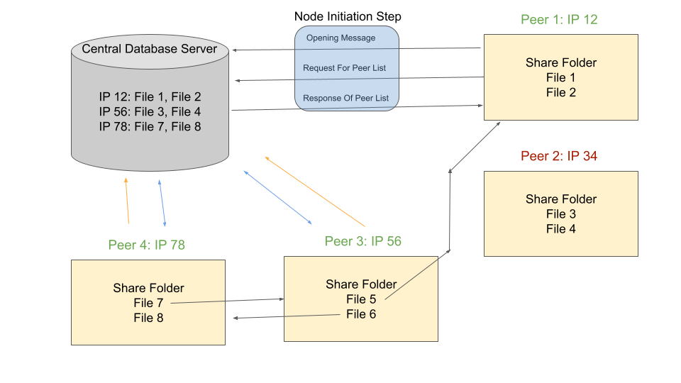
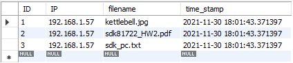

# SBC Semi-Distributed Peer-to-Peer File Transfer

## About 

This code repository represents our implementation of a novel semi-distributed file sharing protocol (named above) that we will refer to as SBCFTP. The aim of this project was to combine the best of centralized (client - server) and decentralized (peer-to-peer) architectures to create a simple yet effective file transfer protocol. 

The main idea with our protocol is that peers will only need to use a centralized database server to find each other and the file they want. Once one peer finds another peer with the file it wants, then the job of the central server is done, and the peer can transfer the file with no further help from the central server. This not only speeds up the file transfer process because peers can easily find one another, it also reduces load and storage on the server because the server does not have to actually assist with the transfer of file data, just store a list of node identifiers (IP addresses) and the file names associated with each. 

At a high level, SBCFTP works in the following way:

When each peer (node) comes online it performs what we call the “node initiation step” (denoted in blue above). This process is essentially a check-in with the central server letting it know that a particular node is online and it is available to send and receive files. This process starts with an “Opening Message” in which the node will pass its IP and a list of all files it contains in its “share folder”. The “share folder” will be a special folder on each peer’s system in which files can be placed that the peer is okay sharing with other peers. After the “Opening Message,” the peer will then send a request to the server for all of the contents of its database. In other words, this would be all of the nodes online and the files that they are willing and able to share. Finally, the server responds with the list of active nodes and their associated files. 

At this point, the peer node will also push a time stamp at regular time intervals to the central database server (denoted as the orange arrow above). This will allow the central server to keep track of which nodes are online and which have gone inactive. The central server will do this by finding the difference between the current time stamp and the last time stamp recieved from the peer node. If the difference between these time stamps is greater than some threshold, the database entries associated will be deamed inactive and will be deleted from the database server. 

Now, the peer may choose to request a file download from any of the other active nodes directly. The peer must also accept download requests from other nodes on the network. Once a file transaction is initiated both parties will be notified, but have no obligation other than courtesy to stay for the duration of the transfer process. It would be good practice for peers to remain active until all their file transfers are complete, but this may not always be feasible. When the peer leaves the network, it will notify the central database server before doing so that it is going offline. The server will then remove the node’s IP and associated files from the database so that no other peer will be able to make requests to that node. In this way, nodes will be able to come and go from the broader network.

## Implementation

### 1. Central Database

Here we will discuss more specifcally how the above protocol was implemented. We will first address how the central database was set up. We setup MySQL server on a cloud based Linode Server. We only implemented this protocol on a very small scale so we found that the Nanode 1GB option worked fine for our needs. 

Once the server was set up, we implemented a very basic database schema. It consisted of one table called "peer_list" shown below: 

Finally, we created a script to clean the database at regular intervals to remove inactive or incorrectly pushed files. We chose to use 1 minute intervals, for cleaning but this might need to be adjusted if this protocol is implemented on a larger scale (more than several thousand people). The script we used is src/central_db_cleaner/db_clean.py for your reference. We set this script to run as a CronJob every minute so that the database is cleaned about every minute. 

### 2. Peer Server

Each peer must have its own server running to recieve incoming file download requests from other peers in the network. Our solution to this was to create a simple peer server as src/server.py. 

This scripts starts by connecting to the central MySQL database server. It the pushes up all files in the shared folder called "DistShared" and the IP associated with the current machine. The script then creates a TCP socket and binds it to the machine IP and port number 44444 (arbitrary port we chose). It then continually listens for incoming requests, parses them, and sends back the correct file. 

### 3. Peer Client 

Each peer must also have a way to request files from the other peers. The src/client.py script handles that for us. It start by connecting to the central database then requests all the database entries and displays that information on the console. The user can then choose the index of the file they want to request and confirm this with a Y or n response on the console. The script will then create a socket associate with the associated IP and request the file. It will then listen for the peer server's response, and barring any errors in transmission or IP mismatches, it will recieve the file and store it in the "Downloads" folder. 

### 3. Updating Central DB Timestamp

This script's sole job is to connect with the central MySQL database and update the timestamp for all files stored in the "DistShared" folder. We set this script to push a new timestamp every 15 seconds. 

## Dependencies/Project Needs

To run this project in the way we have implemented it. You must have the following:

* Some version of Python 3 installed

* Pip3

* All packages in our src/requirements.txt file

* MySQL Server (if you choose to implement the central server the same way we did)

* Linode (or other Linux server)

* CronJob (other automated task scheduler)

## Running SBCFTP

Instructions for WINDOWS machines:

1. clone this repo to desired directory

2. in the "DistTermProj" directory, create 2 files called "DistShared" and "Downloads"

3. upload files you wish to share into the "DistShared" file you just made 

4. use powershell to run the following commands

5. cd into "DistTermProj/src"

6. run "./setup.bat" - this will setup virtual environment and install depenedencies

7. run "./run_server.bat" - in other powershells, this starts the server on your machine and starts updating time stamp on the central server so it will know you are still active and online

8. run "python client.py" - this allows you to request files from other nodes 

9. check "Downloads" directory to find you downloaded files 

NOTE: If you have to restart the server, you may get an error saying that process is already running. If this happens, do the following:

1. in powershell, run "Get-Process | where ProcessName -Match python" - this will show you all python processes currently running

2. run "kill <\process id>" - this kills the specified process

## Notes

* Please feel free to take this code and make it your own. This is just a starting place and many improvements could be made to make this a much more robust implementation of the more general SBCFTP protocol. 
* Sometimes the machine running this code will return a different default IP that is different than the actual IP associate with the network card you are transfering data on. For example, it may not pick up the right IP and fail if you are using a laptop that is connected with a WIFI and Ethernet. My recommendation is to just use WIFI connections if you have the option. 
